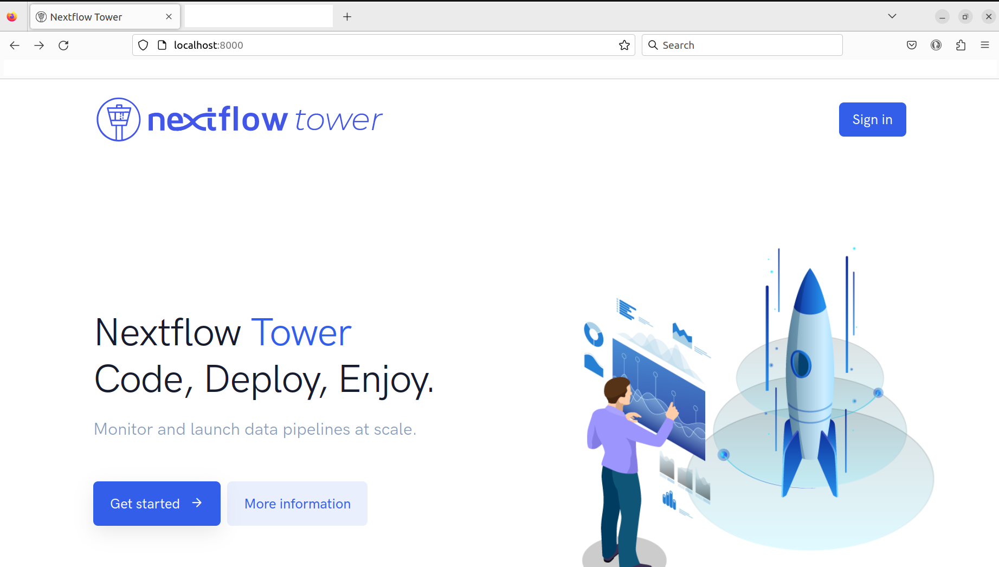
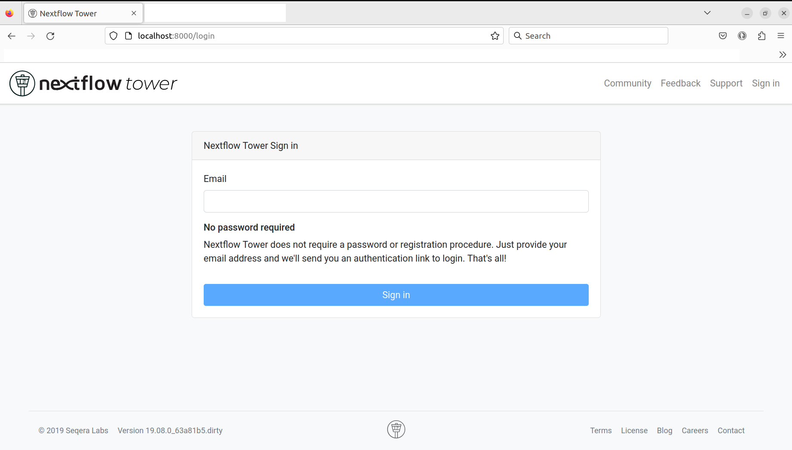
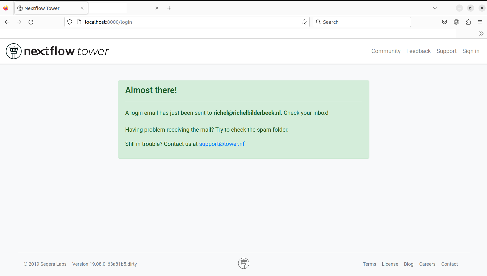

# Run NFT locally in a Singularity container from build

[](https://github.com/richelbilderbeek/nextflow_tower_builder/actions/workflows/check_build_no_changes.yml)
[](https://github.com/richelbilderbeek/nextflow_tower_builder/actions/workflows/check_build.yml)
[](https://github.com/richelbilderbeek/nextflow_tower_builder/actions/workflows/check_links.yaml)

Goal is to run the Nextflow Tower community edition locally,
as a Singularity container,
by building the code from [nf-tower](https://github.com/seqeralabs/nf-tower).

## 1. Clone the NFT repo

```
./clone_repo.sh
```

## 2. Build the NFT

```
./build_nft.sh
```

## 3. Run the NFT

```
./run_nft.sh
```

Then go to `http://localhost:8000/` to go to the NFT entry page. 
Click 'Sign in' to go to the login screen.



> The NFT entry page

At the login screen, fill in your password and click 'Sign in'
to go to the 'Login email sent' screen.



> The login screen

After login, an email is sent to you.



> The 'Login email sent' screen

In your inbox, you'll find an email. Click on the link


> The email one gets from Nextflow Tower

After clicking the email, you are in NFT:


Problems is that there is no launchpad:


See [NFT launchpad doc](https://help.tower.nf/22.2/launch/launchpad/).

Also, how to get the credentials?

```
$ wget -qO- localhost:8000
<!doctype html>
<html lang="en">
<head>
  <meta charset="utf-8">
  <title>Nextflow Tower</title>
  <base href="/">

  <meta name="viewport" content="width=device-width, initial-scale=1">
  <link rel="icon" type="image/x-icon" href="/favicon.ico">
<link rel="stylesheet" href="styles.399d41610a18b056efff.css"></head>
<body>
  <wt-main></wt-main>
<script src="runtime.c51bd5b1c616d9ffddc1.js" defer></script><script src="polyfills-es5.fcebe5b129b20053787b.js" nomodule defer></script><script src="polyfills.f51d8f533e73eb84d944.js" defer></script><script src="scripts.beb850790cbf30a90c2b.js" defer></script><script src="main.80e4c4b5e614725316e2.js" defer></script></body>
</html>
```
## Notes

State of the network:

```
$ ./view_docker_network.sh

NETWORK ID     NAME                DRIVER    SCOPE
68fa2c9cfc22   bridge              bridge    local
2466b50fc0f5   host                host      local
7adff90eb5e6   nf-tower_backend    bridge    local
d924a8a334e0   nf-tower_frontend   bridge    local
ba5e9165ecb0   none                null      local
```

## Appendix

## `build_nft.sh` success

```
$ build_nft.sh 

./gradlew assemble
Downloading https://services.gradle.org/distributions/gradle-5.5.1-all.zip
..................................................................................................................................

Welcome to Gradle 5.5.1!

Here are the highlights of this release:
 - Kickstart Gradle plugin development with gradle init
 - Distribute organization-wide Gradle properties in custom Gradle distributions
 - Transform dependency artifacts on resolution

For more details see https://docs.gradle.org/5.5.1/release-notes.html

Starting a Gradle Daemon (subsequent builds will be faster)

> Task :tower-backend:compileGroovy
WARNING: An illegal reflective access operation has occurred
WARNING: Illegal reflective access by org.codehaus.groovy.reflection.CachedConstructor$1 (file:/home/richel/.gradle/caches/modules-2/files-2.1/org.codehaus.groovy/groovy/2.5.8/2f1e8ea55e625fe51e85ef35eb067f1d9c61772d/groovy-2.5.8.jar) to constructor java.util.Collections$EmptyMap()
WARNING: Please consider reporting this to the maintainers of org.codehaus.groovy.reflection.CachedConstructor$1
WARNING: Use --illegal-access=warn to enable warnings of further illegal reflective access operations
WARNING: All illegal access operations will be denied in a future release

BUILD SUCCESSFUL in 1m 9s
6 actionable tasks: 6 executed
./gradlew tower-backend:jibDockerBuild

> Task :tower-backend:jibDockerBuild

Containerizing application to Docker daemon as tower-backend...
Base image 'seqeralabs/nf-jdk:corretto-8u252' does not use a specific image digest - build may not be reproducible
The base image requires auth. Trying again for seqeralabs/nf-jdk:corretto-8u252...
Using base image with digest: sha256:6d7075dc841c2f8f6f3654e9e573cdda86c38a0f9f9dfcb745e8bbd7633f7714

Container entrypoint set to [/bin/sh]
Container program arguments set to [/tower.sh]

Built image to Docker daemon as tower-backend
Executing tasks:
[==============================] 100.0% complete


BUILD SUCCESSFUL in 1m 1s
3 actionable tasks: 1 executed, 2 up-to-date
docker build -t tower-web:latest tower-web/
Sending build context to Docker daemon  11.02MB
Step 1/12 : FROM node:12.0.0-alpine AS builder
12.0.0-alpine: Pulling from library/node
bdf0201b3a05: Pull complete 
a25bad8e05ec: Pull complete 
758c485a1ddc: Pull complete 
Digest: sha256:0a40e4250e74881c87ac7a44d64e7627820384db8d2f3ce33f05d5bafd28c7d6
Status: Downloaded newer image for node:12.0.0-alpine
 ---> 80a733d0cd8c
Step 2/12 : RUN npm config set unsafe-perm true
 ---> Running in d04e025ec009
Removing intermediate container d04e025ec009
 ---> 4999a22e0978
Step 3/12 : RUN npm install -g @angular/cli
 ---> Running in 66fbaf01f01f
/usr/local/bin/ng -> /usr/local/lib/node_modules/@angular/cli/bin/ng.js
npm WARN @angular-devkit/core@16.2.0 requires a peer of chokidar@^3.5.2 but none is installed. You must install peer dependencies yourself.

+ @angular/cli@16.2.0
added 248 packages from 165 contributors in 17.738s
Removing intermediate container 66fbaf01f01f
 ---> ec2040999baa
Step 4/12 : WORKDIR /usr/src/app
 ---> Running in 3c1c911981c4
Removing intermediate container 3c1c911981c4
 ---> 88389ec79845
Step 5/12 : COPY . .
 ---> 7f8ea0a6a956
Step 6/12 : RUN npm install
 ---> Running in bb1a57649c26

> core-js@3.6.4 postinstall /usr/src/app/node_modules/@angular-devkit/build-angular/node_modules/core-js
> node -e "try{require('./postinstall')}catch(e){}"

Thank you for using core-js ( https://github.com/zloirock/core-js ) for polyfilling JavaScript standard library!

The project needs your help! Please consider supporting of core-js on Open Collective or Patreon: 
> https://opencollective.com/core-js 
> https://www.patreon.com/zloirock 

Also, the author of core-js ( https://github.com/zloirock ) is looking for a good job -)


> core-js@2.6.11 postinstall /usr/src/app/node_modules/core-js
> node -e "try{require('./postinstall')}catch(e){}"


> @angular/cli@9.1.12 postinstall /usr/src/app/node_modules/@angular/cli
> node ./bin/postinstall/script.js

npm WARN optional SKIPPING OPTIONAL DEPENDENCY: fsevents@1.2.13 (node_modules/webpack-dev-server/node_modules/fsevents):
npm WARN notsup SKIPPING OPTIONAL DEPENDENCY: Unsupported platform for fsevents@1.2.13: wanted {"os":"darwin","arch":"any"} (current: {"os":"linux","arch":"x64"})
npm WARN optional SKIPPING OPTIONAL DEPENDENCY: fsevents@1.2.13 (node_modules/watchpack-chokidar2/node_modules/fsevents):
npm WARN notsup SKIPPING OPTIONAL DEPENDENCY: Unsupported platform for fsevents@1.2.13: wanted {"os":"darwin","arch":"any"} (current: {"os":"linux","arch":"x64"})
npm WARN optional SKIPPING OPTIONAL DEPENDENCY: fsevents@1.2.13 (node_modules/karma/node_modules/fsevents):
npm WARN notsup SKIPPING OPTIONAL DEPENDENCY: Unsupported platform for fsevents@1.2.13: wanted {"os":"darwin","arch":"any"} (current: {"os":"linux","arch":"x64"})
npm WARN optional SKIPPING OPTIONAL DEPENDENCY: fsevents@2.1.3 (node_modules/fsevents):
npm WARN notsup SKIPPING OPTIONAL DEPENDENCY: Unsupported platform for fsevents@2.1.3: wanted {"os":"darwin","arch":"any"} (current: {"os":"linux","arch":"x64"})

added 1492 packages from 1140 contributors and audited 1502 packages in 33.975s
found 236 vulnerabilities (4 low, 73 moderate, 127 high, 32 critical)
  run `npm audit fix` to fix them, or `npm audit` for details
Removing intermediate container bb1a57649c26
 ---> fe70b9e04de7
Step 7/12 : RUN npm run build
 ---> Running in f2d803946ce6

> tower-web@19.9.0 build /usr/src/app
> ng build --prod

Compiling @angular/core : module as esm5
Compiling @angular/cdk/keycodes : module as esm5
Compiling @angular/animations : module as esm5
Compiling ngx-bootstrap/chronos : module as esm5
Compiling @angular/compiler/testing : module as esm5
Compiling ngx-bootstrap/mini-ngrx : module as esm5
Compiling @angular/cdk/testing : module as esm5
Compiling humanize-duration-ts : module as esm5
Compiling ngx-bootstrap/locale : module as esm5
Compiling @angular/common : module as esm5
Compiling @angular/cdk/coercion : module as esm5
Compiling @angular/cdk : module as esm5
Compiling @angular/animations/browser : module as esm5
Compiling ngx-bootstrap/utils : module as esm5
Compiling @angular/cdk/collections : module as esm5
Compiling @angular/cdk/portal : module as esm5
Compiling @angular/core/testing : module as esm5
Compiling @angular/cdk/observers : module as esm5
Compiling @angular/cdk/accordion : module as esm5
Compiling ngx-bootstrap/collapse : module as esm5
Compiling ng-chartist : module as esm5
Compiling @angular/cdk/platform : module as esm5
Compiling @angular/forms : module as esm5
Compiling @angular/cdk/bidi : module as esm5
Compiling @angular/platform-browser : module as esm5
Compiling ngx-bootstrap/positioning : module as esm5
Compiling @angular/cdk/a11y : module as esm5
Compiling @angular/cdk/layout : module as esm5
Compiling @angular/common/http : module as esm5
Compiling @angular/cdk/text-field : module as esm5
Compiling @angular/cdk/scrolling : module as esm5
Compiling ngx-bootstrap/component-loader : module as esm5
Compiling @angular/platform-browser/animations : module as esm5
Compiling @angular/cdk/table : module as esm5
Compiling @angular/cdk/stepper : module as esm5
Compiling @angular/cdk/tree : module as esm5
Compiling @angular/platform-browser-dynamic : module as esm5
Compiling @angular/cdk/overlay : module as esm5
Compiling @angular/platform-browser/testing : module as esm5
Compiling @angular/material/core : module as esm5
Compiling @angular/material/expansion : module as esm5
Compiling @angular/common/testing : module as esm5
Compiling @angular/router : module as esm5
Compiling @angular/animations/browser/testing : module as esm5
Compiling @angular/cdk/drag-drop : module as esm5
Compiling @angular/common/http/testing : module as esm5
Compiling @angular/material/form-field : module as esm5
Compiling @angular/material/button : module as esm5
Compiling @angular/material/tooltip : module as esm5
Compiling @angular/material/dialog : module as esm5
Compiling @angular/material/divider : module as esm5
Compiling @angular/material/icon : module as esm5
Compiling @angular/material/sort : module as esm5
Compiling @angular/material/badge : module as esm5
Compiling @angular/material/bottom-sheet : module as esm5
Compiling @angular/material/select : module as esm5
Compiling @angular/material/input : module as esm5
Compiling @angular/material/autocomplete : module as esm5
Compiling @angular/material/button-toggle : module as esm5
Compiling @angular/material/card : module as esm5
Compiling @angular/material/checkbox : module as esm5
Compiling @angular/material/chips : module as esm5
Compiling @angular/material/datepicker : module as esm5
Compiling @angular/material/paginator : module as esm5
Compiling @angular/material/grid-list : module as esm5
Compiling @angular/material/list : module as esm5
Compiling @angular/material/menu : module as esm5
Compiling @angular/material/progress-bar : module as esm5
Compiling @angular/material/progress-spinner : module as esm5
Compiling @angular/material/radio : module as esm5
Compiling @angular/material/sidenav : module as esm5
Compiling @angular/material/slide-toggle : module as esm5
Compiling @angular/material/slider : module as esm5
Compiling @angular/material/snack-bar : module as esm5
Compiling @angular/material/stepper : module as esm5
Compiling @angular/material/table : module as esm5
Compiling @angular/material/tabs : module as esm5
Compiling @angular/material/toolbar : module as esm5
Compiling @angular/material/tree : module as esm5
Compiling @angular/platform-browser-dynamic/testing : module as esm5
Compiling @angular/router/testing : module as esm5
Compiling ngx-bootstrap/accordion : module as esm5
Compiling ngx-bootstrap/alert : module as esm5
Compiling ngx-bootstrap/buttons : module as esm5
Compiling ngx-bootstrap/carousel : module as esm5
Compiling ngx-bootstrap/datepicker : module as esm5
Compiling ngx-bootstrap/dropdown : module as esm5
Compiling @angular/material : module as esm5
Compiling ngx-bootstrap/modal : module as esm5
Compiling ngx-bootstrap/pagination : module as esm5
Compiling ngx-bootstrap/popover : module as esm5
Compiling ngx-bootstrap/progressbar : module as esm5
Compiling ngx-bootstrap/rating : module as esm5
Compiling ngx-bootstrap/sortable : module as esm5
Compiling ngx-bootstrap/tabs : module as esm5
Compiling ngx-bootstrap/timepicker : module as esm5
Compiling ngx-bootstrap/tooltip : module as esm5
Compiling ngx-bootstrap/typeahead : module as esm5
Compiling ngx-virtual-scroller : module as esm5

chunk {} runtime.c51bd5b1c616d9ffddc1.js (runtime) 1.45 kB [entry] [rendered]
chunk {1} main.80e4c4b5e614725316e2.js (main) 2.88 MB [initial] [rendered]
chunk {2} polyfills.f51d8f533e73eb84d944.js (polyfills) 44.2 kB [initial] [rendered]
chunk {3} polyfills-es5.fcebe5b129b20053787b.js (polyfills-es5) 127 kB [initial] [rendered]
chunk {4} styles.399d41610a18b056efff.css (styles) 411 kB [initial] [rendered]
chunk {scripts} scripts.beb850790cbf30a90c2b.js (scripts) 259 kB [entry] [rendered]
Date: 2023-08-18T10:24:05.757Z - Hash: da26c044b87573293207 - Time: 100844ms

WARNING in budgets: Exceeded maximum budget for initial. Budget 2 MB was not met by 1.7 MB with a total of 3.7 MB.
Removing intermediate container f2d803946ce6
 ---> c4fbbf117c25
Step 8/12 : FROM nginx:stable-alpine
stable-alpine: Pulling from library/nginx
9398808236ff: Pull complete 
708173787fc8: Pull complete 
b5b131b8c886: Pull complete 
ab69664ce136: Pull complete 
d7f3c29ebbc5: Pull complete 
80b006910f42: Pull complete 
ba13ff899438: Pull complete 
Digest: sha256:76ca7f6bfe01c3e22e3af85fd37c30149ece3ac2a444973687cab1765abca115
Status: Downloaded newer image for nginx:stable-alpine
 ---> 6dae3976ee05
Step 9/12 : LABEL version="1.0"
 ---> Running in 41adfd51c75b
Removing intermediate container 41adfd51c75b
 ---> 8fc7fba83b5a
Step 10/12 : COPY nginx.conf /etc/nginx/nginx.conf
 ---> a6acda043464
Step 11/12 : WORKDIR /usr/share/nginx/html
 ---> Running in 0baa27f92270
Removing intermediate container 0baa27f92270
 ---> 3dc691a1bc3b
Step 12/12 : COPY --from=builder /usr/src/app/dist/tower-web/ .
 ---> 5ac08a529a09
Successfully built 5ac08a529a09
Successfully tagged tower-web:latest
```

## docker-compose: No such file or directory

```
$ make run
docker-compose up
make: docker-compose: No such file or directory
```

Solution:

```
sudo apt  install docker-compose
```

## Unknown error

```
$ make run
[...]
backend_1   | Error: A JNI error has occurred, please check your installation and try again
backend_1   | Exception in thread "main" java.lang.UnsupportedClassVersionError: io/seqera/tower/Application has been compiled by a more recent version of the Java Runtime (class file version 55.0), this version of the Java Runtime only recognizes class file versions up to 52.0
```


## Links

 * [Launch NFT in a Singularity container starting from a Dockerfile](https://github.com/richelbilderbeek/launch_nft_locally_in_singularity_from_dockerfile)
